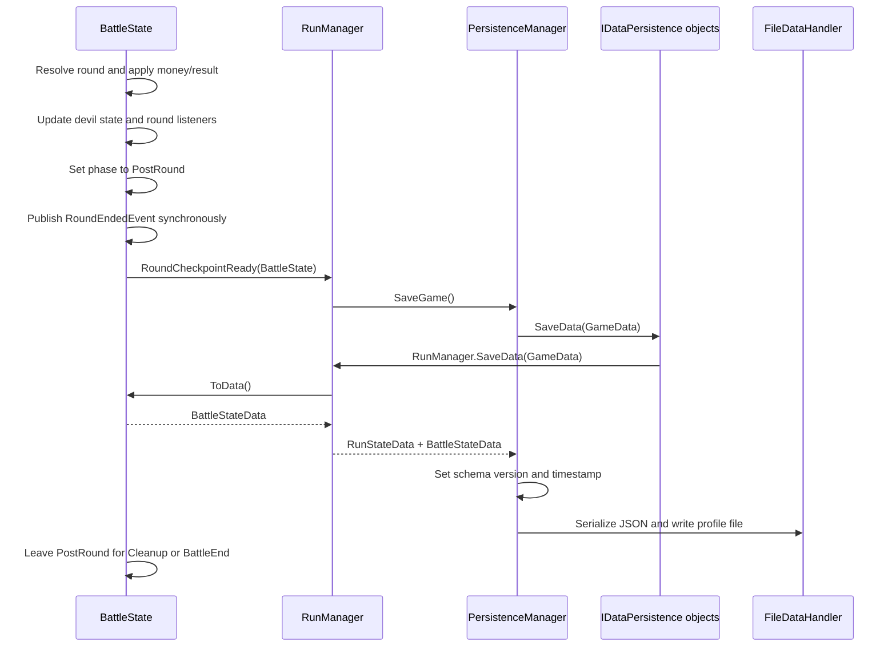
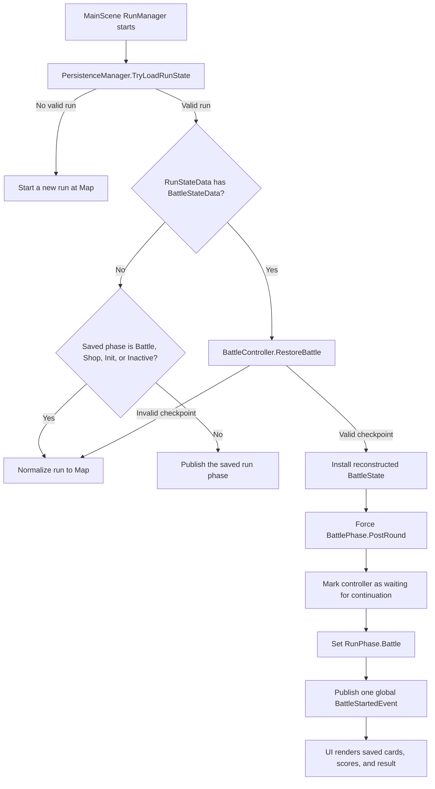

# Save System Logic Flow

This document describes how the game creates, writes, selects, loads, validates, and resumes save data. The save system uses **committed checkpoints**: it saves the run at battle start and after a round has completely resolved, but it does not save arbitrary in-round actions.

## Checkpoint contract

There are two battle-related save states:

1. **Run-only checkpoint** — written when a persistent battle starts, before round one. `RunStateData.battleState` is null.
2. **Post-round checkpoint** — written after a resolved round. It contains both the run and an exact `BattleStateData` snapshot whose phase is `BattlePhase.PostRound`.

This produces the following behavior:

| Player quits at | Saved result when continuing |
| --- | --- |
| Map, rewards, or another non-battle run phase | Restore that run phase normally |
| During round one, before a round resolves | Load the run at Map and restart the encounter from scratch |
| During a later unresolved round | Restore the last resolved round at PostRound; discard the unfinished round |
| After a resolved non-final round | Show the saved result and allow Shop or Continue |
| After a resolved final round | Show the final saved result; Continue applies the battle result once |

Shop purchases and in-round mutations become durable when a later round checkpoint includes the updated `RunState`. Returning through the settings menu does not create a checkpoint.

## Main components

| Component | Responsibility |
| --- | --- |
| [`GameData`](Tools/DataPersistence/GameData.cs) | Root JSON object, schema version, timestamp, run data, and other persistence payloads |
| [`RunStateData`](Tools/DataPersistence/GameData.cs) | Serializable run state and optional `BattleStateData` |
| [`BattleStateData`](Tools/DataPersistence/GameData.cs) | Versioned exact PostRound battle checkpoint |
| [`PersistenceManager`](Runtime/PersistenceManager.cs) | Profile/file selection, calls `IDataPersistence`, and reads/writes JSON |
| [`RunManager`](Runtime/RunManager.cs) | Decides when battle checkpoints are written and how a loaded run is normalized |
| [`BattleState`](Core/Gameplay/BattleState.cs) | Captures and reconstructs the battle domain state |
| [`RoundState`](Core/Gameplay/RoundState.cs) | Captures and reconstructs the resolved round |
| [`Deck`](Core/Gameplay/Deck.cs) | Captures ordered draw/discard piles and deck RNG state |
| [`ReplayableRandom`](Core/Gameplay/ReplayableRandom.cs) | Records the seed and random-call history needed to resume the same sequence |
| [`BattleController`](Runtime/BattleController.cs) | Installs a restored battle and performs PostRound cleanup/continuation |
| [`MainMenu`](Tools/MainMenu.cs) | Enables Continue when a valid profile exists and loads the newest valid profile |

## Serialization and saving

### High-level flow



### Battle-start checkpoint

[`RunManager.StartBattle`](Runtime/RunManager.cs) performs these operations in order:

1. Creates and initializes a new `BattleState`.
2. Sets `RunState.Phase` to `RunPhase.Battle`.
3. Subscribes to `BattleState.RoundCheckpointReady`.
4. Calls `PersistenceManager.SaveGame()` when persistence is enabled.
5. Publishes the global `BattleStartedEvent`.

At this point the battle is not `PostRound`, so `BattleState.ToData()` returns null. The file therefore contains the run in `RunPhase.Battle`, but no battle snapshot. During loading, that combination is deliberately normalized to Map.

### Round-end autosave timing

[`BattleState.ResolveRound`](Core/Gameplay/BattleState.cs) completes gameplay work before requesting a checkpoint:

1. Resolve money transfers and create the `RoundResolution`.
2. Append the resolution to combat history.
3. Update mutable devil strategy state.
4. Advance shop inflation and refresh the opponent field.
5. Set `BattlePhase.PostRound`.
6. Publish the scoped `RoundEndedEvent`.
7. Invoke `RoundCheckpointReady` after all synchronous round-end handlers finish.
8. Queue round-end visuals.
9. Change the live battle to `Cleanup` or `BattleEnd`.

The temporary PostRound phase is important. [`BattleState.ToData`](Core/Gameplay/BattleState.cs) only returns a snapshot while:

- the phase is `BattlePhase.PostRound`;
- a current round exists; and
- at least one `RoundResolution` exists.

Consequently, calls to `SaveGame()` outside the committed round-end window cannot serialize unfinished battle actions.

### `PersistenceManager.SaveGame`

`SaveGame()` refreshes the list of active `IDataPersistence` objects and passes the same `GameData` instance to each `SaveData` implementation. `RunManager.SaveData` then calls:

```csharp
data.runState = RunState.ToDataWithBattleState(activeBattle);
```

The root `GameData.schemaVersion` and `timestamp` are updated after persistence objects contribute their data, and [`FileDataHandler`](Tools/DataPersistence/FileDataHandler.cs) serializes the result with `JsonUtility`.

### Data stored in a PostRound checkpoint

`RunStateData` stores the normal run-level state:

- run phase, seed, money, encounter/difficulty/devil progression;
- shop inflation and player burst-threshold bonus;
- run deck and card instance IDs;
- relics, global modifiers, active items, and rank upgrades;
- devil affinities and completed battle history;
- optional `battleState`.

`BattleStateData` stores the exact resolved battle checkpoint:

- stable encounter, devil, and strategy identifiers plus battle configuration;
- opponent money, battle seed, round number, and reshuffle count;
- the resolved `RoundStateData` and round-resolution history;
- ordered player/opponent draw and discard piles;
- hand carryover, active modifiers, and card ownership information;
- battle and deck RNG seed/call history;
- mutable devil strategy state;
- mutable relic runtime counters/state.

The serialized phase is always `BattlePhase.PostRound`.

## Deserialization and loading

### Continue button and profile selection

[`MainMenu`](Tools/MainMenu.cs) keeps the existing Load button reserved for a future profile picker. The separate Continue button works as follows:

1. `HasAnyValidSave()` scans available profile files.
2. Corrupt files and files without a reconstructable `RunStateData` are ignored.
3. The valid profile with the newest timestamp is selected.
4. Clicking Continue calls `TryLoadMostRecentGame()`.
5. MainScene is entered only when loading succeeds.

### MainScene load flow



[`RunManager.LoadData`](Runtime/RunManager.cs) reconstructs the run first with `RunState.FromData`. It then delegates optional battle restoration to [`BattleController.RestoreBattle`](Runtime/BattleController.cs).

### Battle checkpoint validation

[`BattleState.FromData`](Core/Gameplay/BattleState.cs) rejects a checkpoint when any required invariant is invalid, including:

- unsupported battle snapshot version;
- phase other than PostRound;
- missing round, deck, RNG, configuration, or combat history;
- unknown strategy identifier or mismatched strategy runtime data;
- battle/deck RNG seeds that do not match the reconstructed run;
- invalid random call ranges;
- round number or card-owner list inconsistencies.

The battle configuration is reconstructed from stable strategy IDs such as `basic`, `devil1`, and `devil2`; CLR type names are not stored in the file.

If battle reconstruction fails, the valid run is retained but normalized to Map. This is also the compatibility path for legacy saves that have no `battleState` field.

### Reconstructing exact state

Restoration is data-driven and does not replay gameplay events:

1. Reconstruct `BattleConfig` from stable IDs.
2. Reconstruct `RoundState`, ordered decks, and replayable RNG objects.
3. Create a `BattleState` to establish normal strategy/relic bindings.
4. Replace its generated runtime state with the serialized state.
5. Restore active modifiers, combat history, carryover cards, devil fields, and relic counters.
6. Force `BattlePhase.PostRound` without replaying round resolution or animations.

Only after reconstruction succeeds does `RunManager` publish one global `BattleStartedEvent`, allowing scene presenters to bind and render the restored state.

## Continuing a restored PostRound

`BattleController.RestoreBattle` sets `IsWaitingForVisuals` so normal battle inputs cannot start another round before the saved result is acknowledged.

[`BattleUiPresenter`](Presentation/UI/Battle/BattleUiPresenter.cs) treats both `Cleanup` and `PostRound` as completed-round states. This makes the saved score/result and Shop/Continue controls visible.

When the player continues:

1. `RunManager.ContinueImmediatelyAfterRound()` or `ContinueFromShop()` calls `BattleController.CompletePendingVisualTransition()`.
2. A PostRound battle runs `BattleState.CleanupRound()` exactly once.
3. A non-final battle moves to `BattlePhase.PreRound` and accepts the next wager.
4. A final battle moves to `BattleEnd` and publishes one `BattleEndedEvent`.
5. `RunManager.OnBattleEnded` applies the result to the run, updates battle history/encounter progression, disposes the battle, and enters Rewards.

After the controller clears its waiting flag, repeated Continue calls cannot apply the same final result again.

## Scene-specific behavior

- **MainScene:** `RunManager.persistenceEnabled` is true. It loads runs, creates the battle-start checkpoint, and autosaves resolved rounds.
- **TutorialScene:** `RunManager.persistenceEnabled` is false. It neither loads the normal run nor contributes tutorial state to `GameData`, so tutorial play cannot replace a MainScene checkpoint.
- **MenuScene:** owns the persistent `PersistenceManager` and exposes New Game and Continue separately.
- **Settings Return:** only changes scenes. It does not call `SaveGame()` and therefore cannot overwrite the last committed checkpoint with in-progress actions.

## Versioning and extending the save format

- `GameData.CurrentSchemaVersion` versions the root save format.
- `BattleStateData.CurrentVersion` versions the battle checkpoint independently.
- Missing `battleState` data remains valid and loads as a run-only/legacy save.
- Unknown or malformed battle data is discarded without discarding an otherwise valid run.

When adding mutable battle behavior, update all of the following together:

1. Add the field to the appropriate DTO in [`GameData.cs`](Tools/DataPersistence/GameData.cs).
2. Capture it in the owning domain object's `ToData`/persistence-state method.
3. Restore and validate it in `FromData`/persistence-state restoration.
4. Confirm restoration does not publish resolution events or consume new randomness.
5. Add JSON round-trip and uninterrupted-versus-restored continuation tests.
6. Increment the relevant schema version when older data cannot be safely interpreted.

