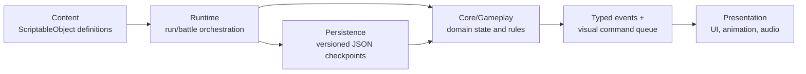

# Devils of Blackjack

Devils of Blackjack is a 2D, single-player card roguelike built in Unity. It combines blackjack-style scoring and burst rules with poker-hand multipliers, wagering, persistent run progression, shops, items, relics, card upgrades, and opponents with distinct strategies.

## Development environment

| Component | Version / choice |
| --- | --- |
| Engine | Unity `6000.3.15f1` (Unity 6) |
| Language | C#, Lua |
| Rendering | Universal Render Pipeline `17.3.0`, 2D Renderer, linear color space |
| Input and UI | Input System `1.19.0`, uGUI `2.0.0`, TextMesh Pro |
| Camera | Cinemachine `3.1.7` |
| Tests | Unity Test Framework `1.6.0` with NUnit-style Edit Mode tests |
| Reference resolution | 1920 × 1080 |
| Current desktop target | Windows x86-64 |

The project also includes or references DOTween, Pixel Crushers Dialogue System, Damage Numbers Pro, UI Effect, UI Particle, and Easy Text Effects. Git must be available to Unity Package Manager because several dependencies in `Packages/manifest.json` use Git URLs.

### Getting started

1. Clone the repository.
2. In Unity Hub, add the repository root as an existing project.
3. Open it with Unity `6000.3.15f1`. Let Unity restore the packages and import the assets.
4. Open `Assets/Scenes/MenuScene.unity` and enter Play Mode.

The enabled build scenes, in order, are:

1. `MenuScene` — new game, continue, tutorial, and settings entry point.
2. `MainScene` — the persistent run and battle loop.
3. `TutorialScene` — a scripted, persistence-isolated tutorial.

To run the automated suite, open **Window > General > Test Runner**, select **EditMode**, and run all tests. The tests cover the gameplay event bus, battle lifecycle and persistence, shops and inflation, active-item selection, devil behavior, tutorial flow, dialogue persistence, tooltips, card previews, deck views, cheat controls, and settings UI.

Do not commit Unity's generated `Library`, `Logs`, `Temp`, or IDE-generated project files. Source assets and their matching `.meta` files must be committed together.

## Features

- **Blackjack and poker hybrid combat.** Players hit, stand, or commit cards from their hand. Blackjack totals determine burst/blackjack states, while poker hands apply score and payout multipliers.
- **Round-based wagering.** Player money is both the run's economy and survival resource. Stakes, pots, wins, draws, burst penalties, and poker payouts are resolved as atomic gameplay operations.
- **Persistent roguelike runs.** A run tracks its seed, deck, money, encounter and devil progression, affinity, relics, active items, rank upgrades, modifiers, and battle history.
- **Independent opponents.** Player and devil use separate decks. Strategy interfaces support different turn decisions, starting decks, wager rules, payout rules, affinity hooks, and serializable opponent state.
- **Shops between rounds.** Seeded offers include consumable active items, passive relics, and rank-based card upgrades. Prices inflate over the run, purchases validate affordability and slot capacity, and ownership survives save/load.
- **Extensible gameplay effects.** Active items perform explicit actions, relics alter rules or react to scoped events, and card upgrades transform player cards when they are played.
- **Deterministic continuation.** Seeded random streams and recorded call histories allow a committed battle checkpoint to resume with the same deck order and future random outcomes.
- **Checkpoint saves and profiles.** The game saves at battle start and after a round resolves, validates restored state, supports multiple profile IDs, and offers Continue from the newest valid profile.
- **Scripted tutorial.** Tutorial steps gate battle input and react to gameplay events without overwriting the normal run save.
- **Presentation systems.** The project includes animated card/score flows, drag interactions, dialogue, audio, tooltips, deck inspection, settings, screen transitions, and debug/cheat tooling.

## Project architecture

The code follows a layered design. Gameplay state does not directly animate UI or play sound; it publishes typed events and queues visual commands for the Unity-facing layers to consume.

### Main directories

| Path | Responsibility |
| --- | --- |
| `Assets/Core/Gameplay` | Domain models and rules: `RunState`, `BattleState`, `RoundState`, decks, scoring, money, modifiers, shops, effects, opponent strategies, events, and replayable randomness. Most of this layer is plain C# and can be tested without entering Play Mode. |
| `Assets/Core/Tutorial` | Tutorial scenario data, input gating, scripted opponent behavior, and instruction flow. |
| `Assets/Runtime` | MonoBehaviour coordinators that own scene lifecycles: `RunManager`, `BattleController`, persistence, audio, dialogue persistence, and scene transitions. |
| `Assets/Content` | ScriptableObject definitions and catalogs for items, relics, upgrades, devil abilities, tutorials, and tooltips. |
| `Assets/Presentation` | UI presenters and views, card interaction, visual command playback, asset lookup, devil visuals, and feedback such as sound and animation. |
| `Assets/Tools` | Shared utilities, main-menu behavior, formatting, debug helpers, and file-backed data persistence. |
| `Assets/Scenes` | Menu, main gameplay, tutorial, and dialogue test scenes. |
| `Assets/Scene-wide Prefabs` | Reusable canvases and managers for battle, shop, map, menu, audio, and settings. |
| `Assets/Tests` | Edit Mode tests for domain rules, persistence, UI binding, and feature regressions. |
| `Assets/Plugins` | Vendored third-party Unity integrations. |

### Runtime flow

1. `RunManager` creates or restores a `RunState` and moves it through run phases.
2. `BattleController` creates a `BattleState` from a `BattleConfig` or installs a validated checkpoint.
3. `BattleState` owns the battle decks, round state, opponent balance, scoped event bus, effect lifetimes, and command queue.
4. `RoundState` enforces turn, hand, played-pile, wager, and resolution invariants. `ScoreResolver` and `MoneyResolver` perform focused calculations.
5. Presentation code sends intent through `BattleController`, observes typed events, and drains `VisualCommand` entries in order.
6. When a round reaches the committed post-round boundary, `RunManager` snapshots the run and battle through `PersistenceManager` into JSON under `Application.persistentDataPath`.

## Core design choices

| Choice | Potential issue | How the project addresses it |
| --- | --- | --- |
| Keep gameplay rules separate from presentation | UI animation timing can drift from authoritative state, or UI code can accidentally become the source of truth. | State changes happen in the gameplay layer. Typed events expose results, and an ordered `CommandQueue` lets presentation finish visuals before `BattleController.NotifyVisualsResolved` advances the flow. |
| Use both global and battle-scoped event buses | A single static bus can leak callbacks across battles and produce duplicate reactions after scene changes. | Run/scene lifecycle messages use the global bus; battle-only messages use a `ScopedEventBus` owned by `BattleState`. Effect and relic runtimes retain subscriptions and dispose them when the battle ends or is abandoned. |
| Store content ownership by stable string ID | Direct ScriptableObject references are fragile in save files, but string IDs can be misspelled, duplicated, or renamed. | Catalogs provide presentation/economy data, resolvers map supported IDs to behavior, and `GameplayAssetRegistry` maps the same IDs to sprites. Released IDs are treated as a serialization contract and must be migrated rather than silently reused. |
| Use deterministic, replayable random streams | Resuming with a seed alone is insufficient after multiple random calls, and use of unrelated random APIs can break reproducibility. | `ReplayableRandom` stores the seed and call history; deck and battle random state are serialized and validated. Shop offers derive their seed from stable run/encounter/round inputs. |
| Save only committed checkpoints | Saving arbitrary in-round mutations can restore half-completed effects, repeat payouts, or make animation state authoritative. The tradeoff is that unresolved actions since the last checkpoint are discarded. | Saves are written at battle start and during a temporary post-round phase after synchronous rule processing completes. Versioned DTOs validate required invariants; invalid battle data is discarded while a valid run falls back safely to the map. |
| Expose invariant-preserving state methods | Public mutable lists or UI-side money/inventory edits would allow impossible hands, negative balances, or items consumed on failed effects. | Collections are exposed read-only. Operations such as purchases, item use, draws, discards, and transfers go through `Try...`/resolver methods and publish results only after a successful atomic change. |
| Separate player and devil decks behind strategy contracts | A shared deck couples both actors' draw order, while large opponent conditionals become difficult to extend and persist. | Each side owns a battle deck. `IDevilStrategy` and smaller optional capability interfaces encapsulate decisions and special wager/payout/field rules; persistable strategies use stable strategy IDs and explicit state DTOs. |
| Keep effect data separate from effect behavior | Allowing ScriptableObjects to execute arbitrary runtime logic makes saves and lifetimes depend on loaded assets; a data-only asset can also appear valid without implemented behavior. | Definitions remain data-only. Active-item, relic, and card-modifier resolvers are explicit extension points, and reactive effects are created with battle-scoped lifetimes. New content must register the same ID in its definition, catalog, resolver, and asset registry and must include activation/save tests. |

### Extension guidelines

- Add gameplay mutations to `BattleState`, `RoundState`, or a focused resolver; do not modify gameplay collections from UI code.
- Use the battle-scoped bus for card, score, round, and battle-only reactions. Use the global bus only for run, shop, ownership, and scene-level notifications.
- Treat content IDs and strategy IDs as permanent save-format identifiers.
- When adding mutable state, update its DTO, capture, validation, restoration, versioning decision, and round-trip/continuation tests together.
- When a state change needs ordered feedback, publish a typed event and enqueue a visual command instead of parsing strings in presentation code.
- Keep authored content in catalogs and `GameplayAssetRegistry`; runtime fallback definitions are safeguards, not a replacement for configured assets.
